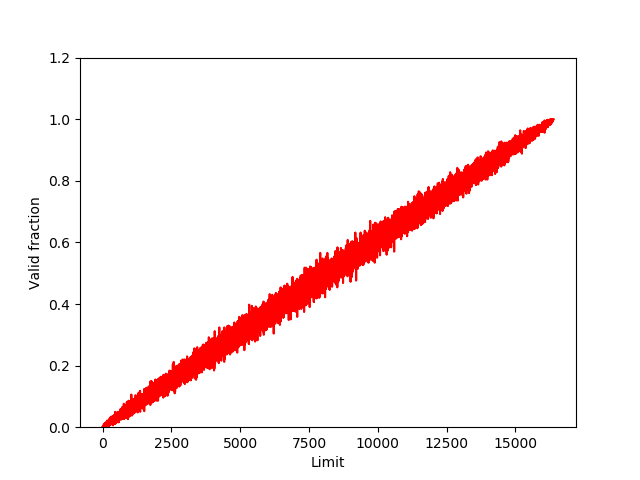

# Homework Simulation Chapter 15 Address Translation Mechanism

## Question 1

> Run with seeds 1, 2, and 3, and compute whether each virtual address generated by the process is in or out of bounds. If in bounds, compute the translation.

**Answer:**

Pretty easy, seems just depends on whether the decimal size of each VA is larger than the decimal limit, if not, add that value to the base decimal:

`./relocation.py -s 1 -c`
`./relocation.py -s 2 -c`
`./relocation.py -s 3 -c`

## Question 2

> Run with these flags: -s 0 -n 10. What value do you have set -l (the bounds register) to in order to ensure that all the generated virtual addresses are within bounds?

**Answer:**

`./relocation.py -s 0 -n 10 -c`

The biggest job is VA 8 with size = 929, thus we need to set `-l 930` to make it work.

## Question 3

> Run with these flags: -s 1 -n 10 -l 100. What is the maximum value that base can be set to, such that the address space still fits into physical memory in its entirety?

**Answer:**

`./relocation.py -s 1 -n 10 -l 100`

Well... the address space size here = 1k

And the largest VA is VA 1 = 867, thus the maximum value of base = 1024 - 867 - 1 = 156 (however the 100 limit will make most of the job SV???...)

Another way to look at it is to base the calculation upon the size of limit.

Thus the max base will be 16k - 100 = 16284
`./relocation.py -s 1 -n 10 -l 100 -b 16284 -c`

## Question 4

> Run some of the same problems above, but with larger address spaces (-a) and physical memories (-p).

**Answer:**

`./relocation.py -s 1 -a 1000 -p 1000 -c` -> Error: physical memory size must be GREATER than address space size (for this simulation)

I tried a couple of ones and didn't find anything necessarily interesting:

`./relocation.py -s 2 -c`

ARG seed 2
ARG address space size 1k
ARG phys mem size 16k

Base-and-Bounds register information:

Base : 0x00003ca9 (decimal 15529)
Limit : 500

Virtual Address Trace
VA 0: 0x00000039 (decimal: 57) --> VALID: 0x00003ce2 (decimal: 15586)
VA 1: 0x00000056 (decimal: 86) --> VALID: 0x00003cff (decimal: 15615)
VA 2: 0x00000357 (decimal: 855) --> SEGMENTATION VIOLATION
VA 3: 0x000002f1 (decimal: 753) --> SEGMENTATION VIOLATION
VA 4: 0x000002ad (decimal: 685) --> SEGMENTATION VIOLATION

`./relocation.py -s 2 -a 2048 -c`

ARG seed 2
ARG address space size 2048
ARG phys mem size 16k

Base-and-Bounds register information:

Base : 0x0000039e (decimal 926)
Limit : 1001

Virtual Address Trace
VA 0: 0x000000ad (decimal: 173) --> VALID: 0x0000044b (decimal: 1099)
VA 1: 0x000006af (decimal: 1711) --> SEGMENTATION VIOLATION
VA 2: 0x000005e3 (decimal: 1507) --> SEGMENTATION VIOLATION
VA 3: 0x0000055b (decimal: 1371) --> SEGMENTATION VIOLATION
VA 4: 0x00000277 (decimal: 631) --> VALID: 0x00000615 (decimal: 1557)

`./relocation.py -s 2 -a 2048 -b 100 -c`

ARG seed 2
ARG address space size 2048
ARG phys mem size 16k

Base-and-Bounds register information:

Base : 0x00000064 (decimal 100)
Limit : 1001

Virtual Address Trace
VA 0: 0x00000795 (decimal: 1941) --> SEGMENTATION VIOLATION
VA 1: 0x00000073 (decimal: 115) --> VALID: 0x000000d7 (decimal: 215)
VA 2: 0x000000ad (decimal: 173) --> VALID: 0x00000111 (decimal: 273)
VA 3: 0x000006af (decimal: 1711) --> SEGMENTATION VIOLATION
VA 4: 0x000005e3 (decimal: 1507) --> SEGMENTATION VIOLATION

`./relocation.py -s 2 -a 2048 -p 20480 -c`

ARG seed 2
ARG address space size 2048
ARG phys mem size 20480

Base-and-Bounds register information:

Base : 0x00004bd3 (decimal 19411)
Limit : 1001

Virtual Address Trace
VA 0: 0x00000073 (decimal: 115) --> VALID: 0x00004c46 (decimal: 19526)
VA 1: 0x000000ad (decimal: 173) --> VALID: 0x00004c80 (decimal: 19584)
VA 2: 0x000006af (decimal: 1711) --> SEGMENTATION VIOLATION
VA 3: 0x000005e3 (decimal: 1507) --> SEGMENTATION VIOLATION
VA 4: 0x0000055b (decimal: 1371) --> SEGMENTATION VIOLATION

## Question 5

> What fraction of randomly-generated virtual addresses are valid, as a function of the value of the bounds register? Make a graph from running with different random seeds, with limit values ranging from 0 up to the maximum size of the address space.

**Answer:**

See `plot.py`

