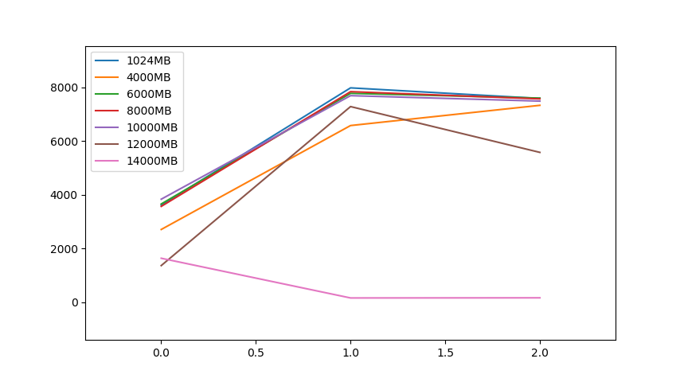

# Homework Simulation Chapter 21 VM Beyond physical memory

## Question 1

> First, open two separate terminal connections to the same machine, so that you can easily run something in one window and the other.
Now,in one window, run `vmstat 1`, which shows statistics about machine usage every second. Read the man page, the associated README, and any other information you need so that you can understand its output. Leave this window running `vmstat` for the rest of the exercises below.
Now, we will run the program `mem.c` but with very little memory usage. This can be accomplished by typing `./mem 1` (which uses only 1 MB of memory). How do the CPU usage statistics change when running `mem`? Do the numbers in the `user time` column make sense? How does this change when running more than one instance of `mem` at once?


**Answer:**
`./mem 1`: for the cpu, the user time (us) will increase from 0 to 13, and the idle time will reduce from 100 to 87.

We can run multiple `mem` using `./mem 1 & ./mem 1 &` and the user time will double.

## Question 2

> Let’s now start looking at some of the memory statistics while running `mem`. We’ll focus on two columns: `swpd` (the amount of virtual memory used) and `free`(the amount of idle memory). Run `./mem 1024` (which allocates 1024 MB) and watch how these values change. Then kill the running program (by typing control-c) and watch again how the values change. What do you notice about the values? In particular, how does the `free` column change when the program exits? Does the amount of free memory increase by the expected amount when `mem` exits?

**Answer:**

In my machine, the `free` starts with value = 12545920; and when `./mem 1024` runs, the `free` reduces to 11495116 which makes sense. And after I terminate the `./mem 1024`, the free will increase back to 12544920 (which is almost the inital value bu 1000 shy.)

## Question 3

> We’ll next look at the `swap` columns(`si` and `so`), which indicate how much swapping is taking place to and from the disk. Of course, to activate these, you’ll need to run `mem` with large amounts of memory. First, examine how much free memory is on your Linux system (for example, by typing `cat /proc/meminfo`; type `man proc` for details on the `/proc` filesystem and the types of information you can find there). One of the first entries in `/proc/meminfo` is the total amount of memory in your system. Let’s assume it’s something like 8GB of memory; if so, start by running `mem 4000`(about 4 GB) and watching the swap in/out columns. Do they ever give non-zero values? Then, try with `5000, 6000`, etc. What happens to these values as the program enters the second loop (and beyond), as compared to the first loop? How much data (total) are swapped in and out during the second, third, and subsequent loops? (do the numbers make sense?)

**Answer:**

hummm... most of the time, the `si` and `so` will remain 0 as I tried `./mem 6000/8000/9000/120000`. In those cases, i understand that the memory is big enough to hold the demand and thus no free nor swap was performed.
```
toby@LAPTOP-GTQEOMNT:~$ free -m
              total        used        free      shared  buff/cache   available
Mem:          12666         101       12248           0         316       12317
Swap:          4096           0        4096
```
The interesting part happenes when I tried `./mem 15000` and I got:
```
procs -----------memory---------- ---swap-- -----io---- -system-- ------cpu-----
 r  b   swpd   free   buff  cache   si   so    bi    bo   in   cs us sy id wa st
 3  0   6068 1269048   2232  22408    0    0     0     0  110   54 31  7 63  0  0
 3  0   6068 614728   2232  22408    0    0     0     0  110   50 27 11 62  0  0
 3  0   6068 401232   2232  22408    0    0     0     0  105   72 28  4 68  0  0
 3  0   6068 401232   2232  22408    0    0     0     0  102  117 29  0 71  0  0
 4  0 357736 126844   2232  21992  260 359972   260 359972  538 1130 28  6 59  8  0
 2  2 676736 121224   2232  22100   28 311124    28 311124  340  892 26  7 58  9  0
 4  0 1319716 121916   2232  23260    0 642884     0 642884 2147 8770 27 11 61  1  0
 2  2 1904160 121308   2232  24588    0 584480     0 584480 2312 9055 26 13 55  6  0
 3  1 2066340 121340   2232  24760    0 162380     0 162380  827 3106 25  3 60 12  0
 3  1 2716296 120872   2232  26264    0 649636     0 649636 2735 11687 26 13 58  2  0
 2  2 3299052 121036   2232  27532    0 582984     0 582984 2415 10165 27 13 58  3  0
 4  0 3912620 119616   2228  28536    0 613376     0 613376 1287 4965 27 17 54  2  0
 3  0 1731100 1429640    272  26504    0 308176  1796 308176  917 4556 24 13 58  5  0
 2  0   5148 12858356    548  19980  380    0  1796     0  334  995 25  5 70  0  0
 2  0   5148 12858356    552  19976    0    0     4     0  107   42 25  0 75  0  0
```

The value in `swpd` and `so` matches pretty nicely.

## Question 4

>  Do the same experiments as above, but now watch the other statistics(such as CPU utilization, and block I/O statistics). How do they change when `mem` is running?

**Answer:**
(restart the vm and got very different result,) the `vmstat 1` printouts are saved in the `./mem14000.md` for reference. From which we can see that, user time increases at first but quickly decrease to 1. `bi`, `bo`, (block in and out), `in` and `cs` (interrupts per second and context switches per second) increase significantly.

## Question 5

>  Now let’s examine performance. Pick an input for `mem` that comfortably fits in memory (say `4000` if the amount of memory on the system is 8 GB). How long does loop 0 take (and subsequent loops 1, 2, etc.)? Now pick a size comfortably beyond the size of memory (say `12000` again assuming 8 GB of memory). How long do the loops take here? How do the bandwidth numbers compare? How different is performance when constantly swapping versus fitting everything comfortably in memory? Can you make a graph, with the size of memory used by `mem` on the x-axis, and the bandwidth of accessing said memory on the y-axis? Finally, how does the performance of the first loop compare to that of subsequent loops, for both the case where everything fits in memory and where it doesn’t?

**Answer:**

If no swap is needed, usually the first iteration will take the longest and the following loops will be significantly faster (2x).

However, if swap is required, the later loops usually will have a reduced bandwidth compared to previous loops (due to more I/O idling.)

```
 ./mem 1024
allocating 1073741824 bytes (1024.00 MB)
  number of integers in array: 268435456
loop 0 in 283.07 ms (bandwidth: 3617.42 MB/s)
loop 2 in 128.20 ms (bandwidth: 7987.52 MB/s)
loop 4 in 134.87 ms (bandwidth: 7592.61 MB/s)
loop 6 in 127.64 ms (bandwidth: 8022.74 MB/s)

./mem 4000
allocating 4194304000 bytes (4000.00 MB)
  number of integers in array: 1048576000
loop 0 in 1477.00 ms (bandwidth: 2708.19 MB/s)
loop 1 in 607.64 ms (bandwidth: 6582.81 MB/s)
loop 2 in 545.21 ms (bandwidth: 7336.58 MB/s)
loop 3 in 515.75 ms (bandwidth: 7755.73 MB/s)

 ./mem 6000
allocating 6291456000 bytes (6000.00 MB)
  number of integers in array: 1572864000
loop 0 in 1639.65 ms (bandwidth: 3659.31 MB/s)
loop 1 in 770.87 ms (bandwidth: 7783.45 MB/s)
loop 2 in 788.87 ms (bandwidth: 7605.86 MB/s)

 ./mem 8000
allocating 8388608000 bytes (8000.00 MB)
  number of integers in array: 2097152000
loop 0 in 2241.63 ms (bandwidth: 3568.83 MB/s)
loop 1 in 1019.68 ms (bandwidth: 7845.60 MB/s)
loop 2 in 1055.82 ms (bandwidth: 7577.06 MB/s)

./mem 10000
allocating 10485760000 bytes (10000.00 MB)
  number of integers in array: 2621440000
loop 0 in 2606.05 ms (bandwidth: 3837.22 MB/s)
loop 1 in 1299.18 ms (bandwidth: 7697.17 MB/s)
loop 2 in 1334.39 ms (bandwidth: 7494.05 MB/s)

./mem 12000
allocating 12582912000 bytes (12000.00 MB)
  number of integers in array: 3145728000
loop 0 in 8807.92 ms (bandwidth: 1362.41 MB/s)
loop 1 in 1646.13 ms (bandwidth: 7289.84 MB/s)
loop 2 in 2149.69 ms (bandwidth: 5582.20 MB/s)
loop 3 in 3730.23 ms (bandwidth: 3216.96 MB/s)

./mem 14000
allocating 14680064000 bytes (14000.00 MB)
  number of integers in array: 3670016000
loop 0 in 8560.00 ms (bandwidth: 1635.51 MB/s)
loop 1 in 90113.72 ms (bandwidth: 155.36 MB/s)
loop 2 in 87154.54 ms (bandwidth: 160.63 MB/s)
```



## Question 6

> Swap space isn’t infinite. You can use the tool `swapon` with the `-s` flag to see how much swap space is available. What happens if you try to run `mem` with increasingly large values, beyond what seems to be available in swap? At what point does the memory allocation fail?


**Answer:**

In my case, `./mem 15000` will fail. (sometimes `./mem 14000` fails after several rounds.)

I believe it depends on a certain percentage of the physcial memory + swap memory.

