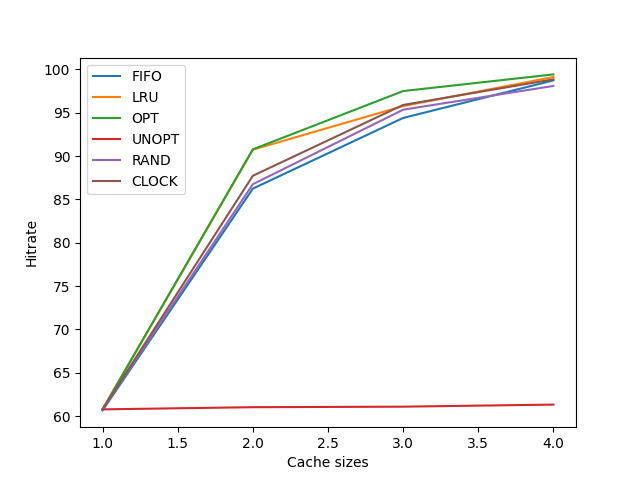

# Homework Simulation Chapter 22 Paging policy

## Question 1

>  Generate random addresses with the following arguments: `-s 0 -n 10`, `-s 1 -n 10`, and `-s 2 -n 10`. Change the policy from FIFO, to LRU, to OPT. Compute whether each access in said address traces are hits or misses.

**Answer:**

```bash
./paging-policy.py -s 0 -n 10 -c
./paging-policy.py -s 0 -n 10 -c --policy=LRU
./paging-policy.py -s 0 -n 10 -c --policy=OPT
```


## Question 2

> For a cache of size 5, generate worst-case address reference streams for each of the following policies: FIFO, LRU, and MRU (worst-case reference streams cause the most misses possible). For the worst case reference streams, how much bigger of a cache is needed to improve performance dramatically and approach OPT?


**Answer:**

The worst case for FIFO and LRU can easily be the loop situation whether the loop size is bigger than the cache size -> thus resulting a miss everytime.

For MRU, we just need to do that in the reverse fashion.

To dramatically improve and approach OPT, we only need to make the cache size larger than the loop size.

```
./paging-policy.py --addresses=0,1,2,3,4,5,0,1,2,3,4,5 --policy=FIFO -C 5 -c
./paging-policy.py --addresses=0,1,2,3,4,5,0,1,2,3,4,5 --policy=LRU -C 5 -c
./paging-policy.py --addresses=0,1,2,3,4,5,4,5,4,5,4,5 --policy=MRU -C 5 -c
```

## Question 3

> Generate a random trace (use python or perl). How would you expect the different policies to perform on such a trace?

**Answer:**

```
./paging-policy.py -s 0 -n 10 -c
FINALSTATS hits 1   misses 9   hitrate 10.00

./paging-policy.py -s 0 -n 10 -c --policy=LRU
FINALSTATS hits 2   misses 8   hitrate 20.00

./paging-policy.py -s 0 -n 10 -c --policy=OPT
FINALSTATS hits 4   misses 6   hitrate 40.00

./paging-policy.py -s 0 -n 10 -c --policy=UNOPT
FINALSTATS hits 0   misses 10   hitrate 0.00

./paging-policy.py -s 0 -n 10 -c --policy=RAND
FINALSTATS hits 0   misses 10   hitrate 0.00

./paging-policy.py -s 0 -n 10 -c --policy=CLOCK
FINALSTATS hits 1   misses 9   hitrate 10.00
```

## Question 4

> Now generate a trace with some locality. How can you generate such a trace? How does LRU perform on it? How much better than RAND is LRU? How does CLOCK do? How about CLOCK with different numbers of clock bits?

**Answer:**

Here's one trace with some temporal locality: [0,6,5,1,2,2,2,3,2,1,2,2,3,2]

```
./paging-policy.py --addresses=0,6,5,1,2,2,2,3,2,1,2,2,3,2 --policy=LRU -c
Access: 0  MISS LRU ->          [0] <- MRU Replaced:- [Hits:0 Misses:1]
Access: 6  MISS LRU ->       [0, 6] <- MRU Replaced:- [Hits:0 Misses:2]
Access: 5  MISS LRU ->    [0, 6, 5] <- MRU Replaced:- [Hits:0 Misses:3]
Access: 1  MISS LRU ->    [6, 5, 1] <- MRU Replaced:0 [Hits:0 Misses:4]
Access: 2  MISS LRU ->    [5, 1, 2] <- MRU Replaced:6 [Hits:0 Misses:5]
Access: 2  HIT  LRU ->    [5, 1, 2] <- MRU Replaced:- [Hits:1 Misses:5]
Access: 2  HIT  LRU ->    [5, 1, 2] <- MRU Replaced:- [Hits:2 Misses:5]
Access: 3  MISS LRU ->    [1, 2, 3] <- MRU Replaced:5 [Hits:2 Misses:6]
Access: 2  HIT  LRU ->    [1, 3, 2] <- MRU Replaced:- [Hits:3 Misses:6]
Access: 1  HIT  LRU ->    [3, 2, 1] <- MRU Replaced:- [Hits:4 Misses:6]
Access: 2  HIT  LRU ->    [3, 1, 2] <- MRU Replaced:- [Hits:5 Misses:6]
Access: 2  HIT  LRU ->    [3, 1, 2] <- MRU Replaced:- [Hits:6 Misses:6]
Access: 3  HIT  LRU ->    [1, 2, 3] <- MRU Replaced:- [Hits:7 Misses:6]
Access: 2  HIT  LRU ->    [1, 3, 2] <- MRU Replaced:- [Hits:8 Misses:6]

FINALSTATS hits 8   misses 6   hitrate 57.14

./paging-policy.py --addresses=0,6,5,1,2,2,2,3,2,1,2,2,3,2 --policy=RAND -c

Access: 0  MISS Left  ->          [0] <- Right Replaced:- [Hits:0 Misses:1]
Access: 6  MISS Left  ->       [0, 6] <- Right Replaced:- [Hits:0 Misses:2]
Access: 5  MISS Left  ->    [0, 6, 5] <- Right Replaced:- [Hits:0 Misses:3]
Access: 1  MISS Left  ->    [0, 6, 1] <- Right Replaced:5 [Hits:0 Misses:4]
Access: 2  MISS Left  ->    [0, 6, 2] <- Right Replaced:1 [Hits:0 Misses:5]
Access: 2  HIT  Left  ->    [0, 6, 2] <- Right Replaced:- [Hits:1 Misses:5]
Access: 2  HIT  Left  ->    [0, 6, 2] <- Right Replaced:- [Hits:2 Misses:5]
Access: 3  MISS Left  ->    [0, 2, 3] <- Right Replaced:6 [Hits:2 Misses:6]
Access: 2  HIT  Left  ->    [0, 2, 3] <- Right Replaced:- [Hits:3 Misses:6]
Access: 1  MISS Left  ->    [2, 3, 1] <- Right Replaced:0 [Hits:3 Misses:7]
Access: 2  HIT  Left  ->    [2, 3, 1] <- Right Replaced:- [Hits:4 Misses:7]
Access: 2  HIT  Left  ->    [2, 3, 1] <- Right Replaced:- [Hits:5 Misses:7]
Access: 3  HIT  Left  ->    [2, 3, 1] <- Right Replaced:- [Hits:6 Misses:7]
Access: 2  HIT  Left  ->    [2, 3, 1] <- Right Replaced:- [Hits:7 Misses:7]

FINALSTATS hits 7   misses 7   hitrate 50.00

./paging-policy.py --addresses=0,6,5,1,2,2,2,3,2,1,2,2,3,2 --policy=CLOCK -c

Access: 0  MISS Left  ->          [0] <- Right Replaced:- [Hits:0 Misses:1]
Access: 6  MISS Left  ->       [0, 6] <- Right Replaced:- [Hits:0 Misses:2]
Access: 5  MISS Left  ->    [0, 6, 5] <- Right Replaced:- [Hits:0 Misses:3]
Access: 1  MISS Left  ->    [0, 6, 1] <- Right Replaced:5 [Hits:0 Misses:4]
Access: 2  MISS Left  ->    [0, 1, 2] <- Right Replaced:6 [Hits:0 Misses:5]
Access: 2  HIT  Left  ->    [0, 1, 2] <- Right Replaced:- [Hits:1 Misses:5]
Access: 2  HIT  Left  ->    [0, 1, 2] <- Right Replaced:- [Hits:2 Misses:5]
Access: 3  MISS Left  ->    [1, 2, 3] <- Right Replaced:0 [Hits:2 Misses:6]
Access: 2  HIT  Left  ->    [1, 2, 3] <- Right Replaced:- [Hits:3 Misses:6]
Access: 1  HIT  Left  ->    [1, 2, 3] <- Right Replaced:- [Hits:4 Misses:6]
Access: 2  HIT  Left  ->    [1, 2, 3] <- Right Replaced:- [Hits:5 Misses:6]
Access: 2  HIT  Left  ->    [1, 2, 3] <- Right Replaced:- [Hits:6 Misses:6]
Access: 3  HIT  Left  ->    [1, 2, 3] <- Right Replaced:- [Hits:7 Misses:6]
Access: 2  HIT  Left  ->    [1, 2, 3] <- Right Replaced:- [Hits:8 Misses:6]

FINALSTATS hits 8   misses 6   hitrate 57.14

./paging-policy.py --addresses=0,6,5,1,2,2,2,3,2,1,2,2,3,2 --policy=CLOCK -c -b 0

Access: 0  MISS Left  ->          [0] <- Right Replaced:- [Hits:0 Misses:1]
Access: 6  MISS Left  ->       [0, 6] <- Right Replaced:- [Hits:0 Misses:2]
Access: 5  MISS Left  ->    [0, 6, 5] <- Right Replaced:- [Hits:0 Misses:3]
Access: 1  MISS Left  ->    [0, 6, 1] <- Right Replaced:5 [Hits:0 Misses:4]
Access: 2  MISS Left  ->    [0, 1, 2] <- Right Replaced:6 [Hits:0 Misses:5]
Access: 2  HIT  Left  ->    [0, 1, 2] <- Right Replaced:- [Hits:1 Misses:5]
Access: 2  HIT  Left  ->    [0, 1, 2] <- Right Replaced:- [Hits:2 Misses:5]
Access: 3  MISS Left  ->    [0, 1, 3] <- Right Replaced:2 [Hits:2 Misses:6]
Access: 2  MISS Left  ->    [1, 3, 2] <- Right Replaced:0 [Hits:2 Misses:7]
Access: 1  HIT  Left  ->    [1, 3, 2] <- Right Replaced:- [Hits:3 Misses:7]
Access: 2  HIT  Left  ->    [1, 3, 2] <- Right Replaced:- [Hits:4 Misses:7]
Access: 2  HIT  Left  ->    [1, 3, 2] <- Right Replaced:- [Hits:5 Misses:7]
Access: 3  HIT  Left  ->    [1, 3, 2] <- Right Replaced:- [Hits:6 Misses:7]
Access: 2  HIT  Left  ->    [1, 3, 2] <- Right Replaced:- [Hits:7 Misses:7]

FINALSTATS hits 7   misses 7   hitrate 50.00
```

LRU was performing pretty well with locality. And RAND is not too bad compared to it (57.14 vs. 50). And surprisingly CLOCK is not doing too bad: with `-b 0` it will achieve 50, and with any other clockbit it will achieve 57.14

## Question 5

> Use a program like `valgrind` to instrument a real application and generate a virtual page reference stream. For example, running `valgrind --tool=lackey --trace-mem=yes ls` will output a nearly-complete reference trace of every instruction and data reference made by the program `ls`. To make this useful for the simulator above, you’ll have to first transform each virtual memory reference into a virtual page-number reference (done by masking off the offset and shifting the resulting bits downward). How big of a cache is needed for your application trace in order to satisfy a large fraction of requests? Plot a graph of its working set as the size of the cache increases.

**Answer:**
