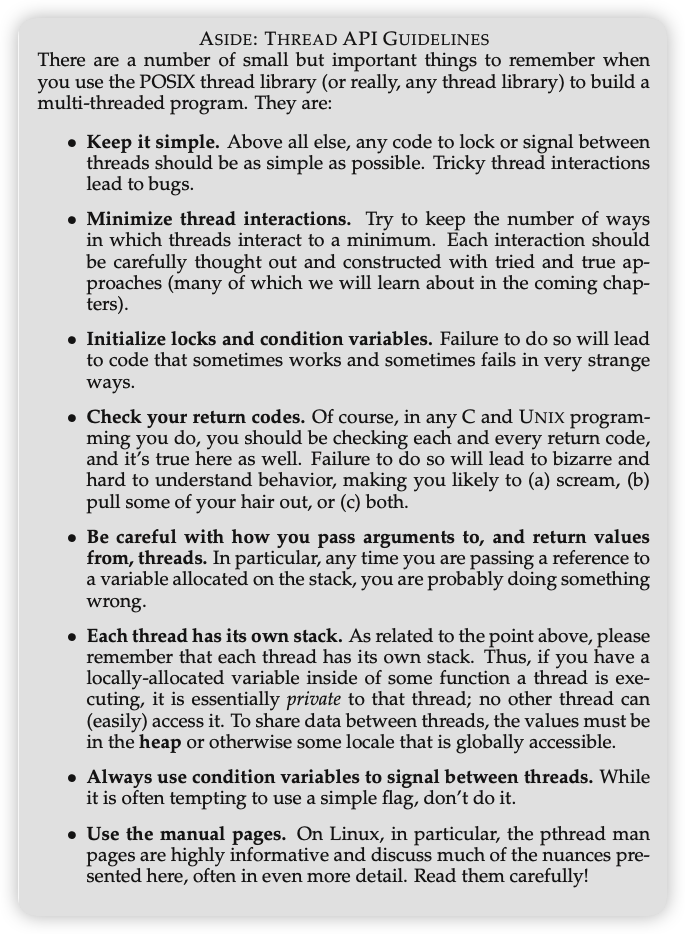
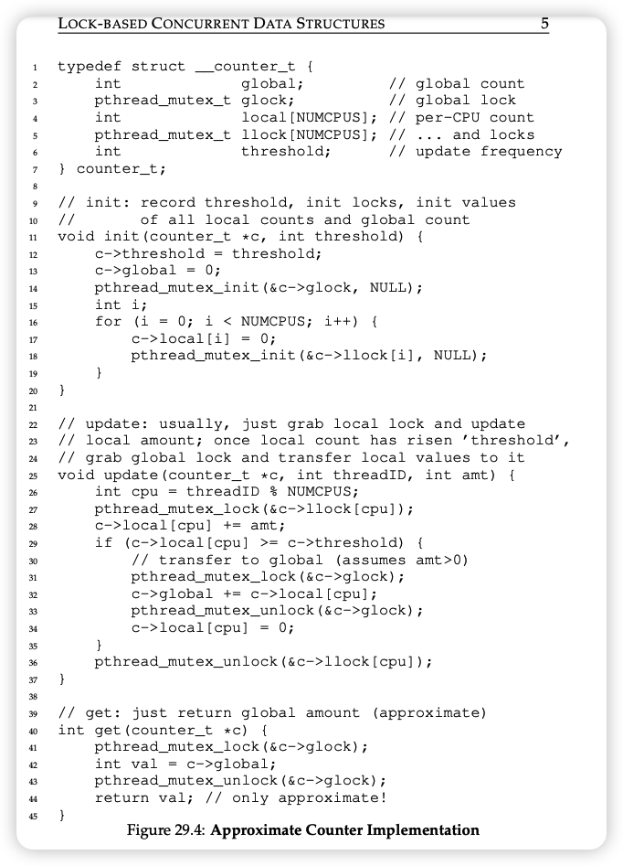

# cs5600_computerSystem_fall2022

Class repo for cs5600, where we dig deep into computer systems.

## Reading Notes

Textbook link: [Operating Systems: Three Easy Pieces](https://pages.cs.wisc.edu/~remzi/OSTEP/)

Homework git resource: [github link](https://github.com/remzi-arpacidusseau/ostep-homework/)

### Chapter 2 intro

Key/Crux of this chapter:

Crux of Virtualization:

> How does the operating system virtualize resources? where **virtualization** == the OS takes a physical resource (processor, memory, or a disk) and transforms it into a more general, powerful, and easy-to-use virtual form of itself.

- provides some interfaces/APIs/system calls that are available to applications (standard library).
- thus OS is known as a resource manager.
- Memory virtualization: each process accesses its own private virtual address space (sometimes just called its address space), which the OS somehow maps onto the physical memory of the machine.

Crux of "How to build correct concurrent programs":

> When there are many concurrently executing threads within the same memory space, how can we build a correctly working program? What primitives are needed from the OS? What mechanisms should be provided by the hardware? How can we use them to solve the problems of concurrency?

Crux of the "how to store data persistently":

> The file system is the part of the OS in charge of managing persistent data. What techniques are needed to do so correctly? What mechanisms and policies are required to do so with high performance? How is reliability achieved, in the face of failures in hardware and software?

### Chapter 4 CPU-Intro, The Abstraction: The Process

The process == a running program. (where a program is a lifeless bunch of instructions and maybe some static data on the disk, waiting to spring into action.)

The Crux of "How to provide the illusion of many CPUs"?

> Although there are only a few physical CPUs available, how can the OS provide the illusion of a nearly-endless supply of said CPUs?

- The OS creates this illusion by virtualizing the CPU. By running one process, then stopping it and running another, and so forth, the OS can promote the illusion that many virtual CPUs exist when in fact there is only one physical CPU (or a few)

- time sharing: is a basic technique used by an OS to share a resource. By allowing the resource to be used for a little while by one entity, and then a little while by another, and so forth, the resource in question (e.g., the CPU, or a network link) can be shared by many. This basic technique, known as time sharing of the CPU, allows users to run as many concurrent processes as they would like; the potential cost is performance, as each will run more slowly if the CPU(s) must be shared.

- mechanism: We call the low-level machinery mechanisms; mechanisms are low-level methods or protocols that implement a needed piece of functionality.

- policy: Policies are algorithms for making some kind of decision within the OS. For example, given a number of possible programs to run on a CPU, which program should the OS run?

- 5 must-have process APIs: create, destroy, wait, miscellaneous control, status.

- 3 process states: running, ready, and blocked

### Chapter 5 Interlude: Process API

- The CPU scheduler (via calling fork()), we can see, is not deterministic. (i.e. the parent process and child process from fork() might get called and executed in any order.)

- This non-determinism, as it turns out, leads to some interesting problems, particularly in multi-threaded programs; hence, we’ll see a lot more non- determinism when we study concurrency in the second part of the book.

- The strangeness of `fork()` and `exec()` (and `wait()`). For now, suffice it to say that the `fork()`/`exec()` combination is a powerful way to create and manipulate processes.

- The `wait()` system call allows a parent to wait for its child to complete execution.

- The `exec()` family of system calls allows a child to break free from its similarity to its parent and execute an entirely new program.

- A UNIX shell commonly uses fork(), wait(), and exec() to launch user commands; the separation of fork and exec enables features like input/output redirection, pipes, and other cool features, all without changing anything about the programs being run.

- Process control other than fork and exec (e.g. kill) can be used to send signals to a process. However, not everyone/application is allowed to do this. Otherwise the usability and security of the system will be compromised. Thus only a validated **user** is allowed to control their own processes.

### Chapter 7 Scheduling

Crux of "How to develope scheduling policy":

> How should we develop a basic framework for thinking about scheduling policies? What are the key assumptions? What metrics are important? What basic approaches have been used in the earliest of computer systems?

- workload: Determining the workload is a critical part of building policies, and the more you know about workload, the more fine-tuned your policy can be.

- (metric) turnaround time: the time at which the job completes minus the time at which the job arrived in the system

- (metric) response time: the time from when the job arrives in a system to the first time it is scheduled

- (policy) Shortest Job First (SJF): it runs the shortest job first, then the next shortest, and so on.

- (policy) Shortest Time-to-Completion First (STCF): Any time a new job enters the system, the STCF scheduler determines which of the remaining jobs (including the new job) has the least time left, and schedules that one. (could pauses the current heavy load work, and switch context to the shorter ones.)

- (policy) round robin /time-slicing: instead of running jobs to completion, RR runs a job for a time slice (sometimes called a scheduling quantum) and then switches to the next job in the run queue. (make scheduling quantum big to reduce the context-switching cost.)

### Chapter 8 The Multi-level feedback queue

Crux of "How to schedule without perfect knowledge?"

> Given that we in general do not know anything about a process, how can we build a scheduler to achivev these goals? How can the scheduler learn, as the system runs, the characteristics of the jobs it is running, and thus make better scheduling decisions? (\*esp. without a priori knowledge of job length?)

- There are two overall goals for MLFQ: 1. optimize turnaround time (~shorter jobs first); 2. minimize response time (~ Round Robin).

- MLFQ's answer: learn from history.
  - the MLFQ has a number of distinct queues, each assigned a different priority level
  - MLFQ uses priorities to decide which job should run at a given time
  - Rule 1: If Priority(A) > Priority(B), A runs (B doesn’t).
  - Rule 2: If Priority(A) = Priority(B), A & B run in RR.
  - Rather than giving a fixed priority to each job, MLFQ varies the priority of a job based on its observed behavior.
  - Rule 3: When a job enters the system, it is placed at the highest priority (the topmost queue).
  - Rule 4a: If a job uses up an entire time slice while running, its priority is reduced (i.e., it moves down one queue).
  - Rule 4b: If a job gives up the CPU before the time slice is up, it stays at the same priority level.
  - because it doesn’t know whether a job will be a short job or a long-running job, it first assumes it might be a short job, thus giving the job high priority. If it actually is a short job, it will run quickly and complete; if it is not a short job, it will slowly move down the queues, and thus soon prove itself to be a long-running more batch-like process. In this manner, MLFQ approximates SJF.
  - FLAWS:
    1. First, there is the problem of starvation: if there are “too many” interactive jobs in the system, they will combine to consume all CPU time, and thus long-running jobs will never receive any CPU time (they starve).
    2. Second, a smart user could rewrite their program to game the scheduler (e.g. before the time slice is over, issue an I/O operation (to some file you don’t care about) and thus relinquish the CPU)
    3. a program may change its behavior over time; what was CPU- bound may transition to a phase of interactivity (but will remain in lowest priority in our current design.)
- MLFQ2 improve: The Priority Boost

  - "Reshuffle"Rule 5: After some time period S, move all the jobs in the system to the topmost queue.
  - Our new rule solves two problems at once. First, processes are guar- anteed not to starve: by sitting in the top queue, a job will share the CPU with other high-priority jobs in a round-robin fashion, and thus eventually receive service. Second, if a CPU-bound job has become interactive, the scheduler treats it properly once it has received the priority boost.
  - However, it is very hard and tricky to set the time period S correct. If it is set too high, long-running jobs could starve; too low, and interactive jobs may not get a proper share of the CPU. "voo-doo constant", "magic number".

- MLFQ3 improve: Better Accounting.

  - goal = to prevent gaming of our scheduler
  - idea = Instead of forgetting how much of a time slice a pro- cess used at a given level, the scheduler should keep track; once a process has used its allotment, it is demoted to the next priority queue. Whether it uses the time slice in one long burst or many small ones does not matter.
  - Rule 4: Once a job uses up its time allotment at a given level (regardless of how many times it has given up the CPU), its priority is reduced (i.e., it moves down one queue).

- Advice:
  As the operating system rarely knows what is best for each and every process of the system, it is often useful to provide interfaces to allow users or administrators to provide some hints to the OS. We often call such hints advice, as the OS need not necessarily pay attention to it, but rather might take the advice into account in order to make a better decision.

### Chapter 9 Scheduling: Proportional Share

Crux: How to share the CPU proportionally.

- Proportional-share is based around a simple concept: instead of optimizing for turnaround or response time, a scheduler might instead try to guarantee that each job obtain a certain percentage of CPU time. (~ fairness)

- Lottery scheduling: every so often, hold a lottery to determine which process should get to run next; processes that should run more often should be given more chances to win the lottery

- One of the most beautiful aspects of lottery scheduling is its use of randomness. When you have to make a decision, using such a randomized approach is often a robust and simple way of doing so.

- lottery ticket: a basic and powerful mechanisms to represent a proportion of ownership.

- ticket currency: Currency allows a user with a set of tickets to allocate tickets among their own jobs in whatever currency they would like; the system then automatically converts said currency into the correct global value. (~each process can set its own ticket amount and distribution, the system will then convert them to system's ticket system.)

- ticket transfer. With transfers, a process can temporarily hand off its tickets to another process. This ability is especially useful in a client/server setting, where a client process sends a message to a server asking it to do some work on the client’s behalf.

- ticket inflation can sometimes be a useful technique. With inflation, a process can temporarily raise or lower the number of tickets it owns. For example, if any one process knows it needs more CPU time, it can boost its ticket value as a way to reflect that need to the system, all without communicating with any other processes. (in a trusted environment only)

- stride scheduling - to improve the randomness of lottery ticket, stride use the ticket to calculate the correct proportion to ensure the proportion is strictly enforced.

- CFS - The Linux Completely Fair Scheduler: implements fair-share scheduling, but does so in a highly efficient and scalable manner.

  - Its goal is simple: to fairly divide a CPU evenly among all competing processes. It does so through a simple counting-based technique known as virtual runtime (vruntime).
  - **sched_latency**. CFS uses this value to determine how long one process should run before considering a switch (effectively determining its time slice but in a dynamic fashion). And it is lower bounded by **min_granularity** to avoid to frequent switch if there are two many processes.
  - niceness (-20 ~ + 19) - CFS also enables controls over process priority, enabling users or administrators to give some processes a higher share of the CPU. Positive nice values imply lower priority and negative values imply higher priority; when you’re too nice, you just don’t get as much (scheduling) attention, alas.

- even after aggressive optimization, scheduling uses about 5% of overall data center CPU time. Reducing that overhead as much as possible is thus a key goal in modern scheduler architecture.

- Lottery uses randomness in a clever way to achieve proportional share; stride does so deterministically. CFS, the only “real” scheduler discussed in this chapter, is a bit like weighted round-robin with dynamic time slices, but built to scale and perform well under load; to our knowledge, it is the most widely used fair-share scheduler in existence today.

Lottery ~ randomness to achieve proportional share
-> problem with not deliver the exact right proportions over short time scales
Stride scheduling ~ a deterministic fair-share scheduler (where stride = inverse of the tickets, i.e. pre-calculate to ensure the exact proportion)
-> problem with a global state (thus making inserting new jobs very difficult)
Completely Fair Scheduler ~ use vruntime, sched_latency, min_granularity, and niceness + red-black tree to achieve a weighted round-robin with dynamic time slices that build to perform well under load.

### Chapter 10, Multiprocessor Scheduling

Crux: How should the OS schedule jobs on multiple CPUs? What new problems arise? Do the same old techniques work, or are new ideas required?

#### What's different about multiprocessor vs. single processor?

1 - Cache and **Cache coherence**: with multiple processor, each processor will be attached to a cache (thus multiple caches). Cache coherence is when one processor 1 modified a value in its cache, yet later another processor 2 tries to access the data, it will get the outdated data from the memory (since the updated value is not in cache2.)

One potential solution for this is call **bus snooping** where each cache pays attention to memory updates by observing the bus that connects them to main memory.

??? why cant we use one big cache for all the processors? or we probably could make a notification mechanism.

2 - Synchronization with lock: lock is required when accessing shared data to avoid potential conflicts. However, as the number of CPUs grows, access to a synchronized shared data structure becomes quite slow. (big performance issue.)

3 - Cache Affinity: the CPU scheduler shall prefer to keep a process on the same CPU if at all possible to take advantage of cache mechanism and improve the performance.

#### Potential Solutions

Solution 1 - Single-Queue multiprocessor scheduling (SQMS) : simply reuse the basic framework for single processor scheduling, by putting all jobs that need to be scheduled into a single queue.

Pro: simple.

Con: performance and lack of scalability due to need for locking. difficulties in cache affinity.

For example:

CPU 0 [A E D C B]

CPU 1 [B A E D C]

CPU 2 [C B A E D]

CPU 3 [D C B A E]

We might can provide affinity for some jobs and move others around to balance load ->

CPU 0 [A E A A A]

CPU 1 [B B E B B]

CPU 2 [C C C E C]

CPU 3 [D D D D E]

Con: would be pretty complex.

Solution 2: Multi-Queue Scheduling

Multiple queues, and each queue will likely follow a particular scheduling discipline, such as round robin, though of course any algorithm can be used. When a job enters the system, it is placed on exactly one scheduling queue, according to some heuristic (e.g., random, or picking one with fewer jobs than others). Then it is scheduled essentially independently, thus avoiding the problems of information sharing and synchronization found in the single-queue approach.

Pros: no need for lock, and intrinsically provides cache affinity

Cons: load imbalance between each queues -> requires migration

migration and load balance: One basic approach is to use a technique known as work stealing, where a (source) queue that is low on jobs will occasionally peek at another (target) queue, to see how full it is. If the target queue is (notably) more full than the source queue, the source will “steal” one or more jobs from the target to help balance load.

Solution 3: Linux Multiprocessor Schedulers

Interestingly, in the Linux community, no common solution has approached to building a multiprocessor scheduler. Over time, three different schedulers arose: the O(1) scheduler, the Completely Fair Scheduler (CFS), and the BF Scheduler (BFS).

Both O(1) and CFS use multiple queues, whereas BFS uses a single queue, showing that both approaches can be successful. O(1) ~ based on priority; CFS more like stride scheduling, do a deterministic proportional-share. BFS is based on Earliest Eligible Virtual Deadline First.

### Chapter 13, The Abstraction: Address Spaces

- Multiprogramming and time sharing: The notion of interactivity became important, as many users might be concurrently using a machine, each waiting for (or hoping for) a timely response from their currently-executing tasks.

- Protection: In particular, allow- ing multiple programs to reside concurrently in memory makes **protection** an important issue; you don’t want a process to be able to read, or worse, write some other process’s memory.

- Address space (code, stack, heap): However, we have to keep those pesky users in mind, and doing so requires the OS to create an easy to use abstraction of physical memory. We call this abstraction the address space, and it is the running program’s view of memory in the system. The address space of a process contains all of the memory state of the running program.

- Goals for virtualizing memory:
  - transparency: (The OS should implement virtual memory in a way that is invisible to the running program. / under the hood);
  - efficiency: The OS should strive to make the virtualization as efficient as possible, both in terms of time (i.e., not mak- ing programs run much more slowly) and space (i.e., not using too much memory for structures needed to support virtualization)
  - protection: The OS should make sure to protect processes from one another as well as the OS itself from process.

---

### Chapter 14, Interlude: Memory API

Toby: this chapter mainly talks about many practical potential errors and mistakes in c coding that is related to memory management (`malloc(), free(), `)

> Crux: In UNIX/C programs, understanding how to allocate and manage memory is critical in building robust and reliable software. What interfaces are commonly used? What mistakes should be avoided?

- Two types of memory (stack and heap):

  - stack: allocations and deallocations of it are managed implicitly by the compiler for you, the programmer; for this reason it is sometimes called **automatic** memory. (e.g. `int x;` is a stack memory declaration.)
  - heap: all allocations and deallocations are **explicitly** handled by you, the programmer. (e.g. `int *x = (int *) malloc(sizeof(int))`)

- memory leak: it occurs when you forget to free memory, thus in long-running apps or systems, this will eventually lead you to run out of memory, and then a restart is required.

---

### Chapter 15, Address Translation Mechanism

Crux: How to efficiently and flexibly virtualize memory?

> recall the virtualization from Chapter 2: each process accesses its own private virtual address space (sometimes just called its address space), which the OS somehow maps onto the physical memory of the machine.

CPU Mechanism - **limited direct execution (LDE)**: for the most part, let the program run directly on the hardware; however, at certain key points in time (such as when a process issues a system call, or a timer interrupt occurs), arrange so that the OS gets involved and makes sure the “right” thing happens. Thus, the OS, with a little hardware support, tries its best to get out of the way of the running program, to deliver an efficient virtualization; however, by inter- posing at those critical points in time, the OS ensures that it maintains control over the hardware.

Memory mechanism - **hardware-based address translation**: With address translation, the **hardware** transforms each memory access (e.g., an instruction fetch, load, or store), changing the virtual address provided by the instruction to a physical address where the desired information is actually located.

??? interposition and interface?? page 3

Privileged mode vs. user mode: on CPU virtualization, we require two different CPU modes. The OS runs in privileged mode (or kernel mode), where it has access to the entire machine; applications run in user mode, where they are limited in what they can do.

### Chapter 16, Segmentation

> Crux: How to support a large address space?

- Segmentation: instead of having just one base and bounds pair in our MMU, why not have a base and bounds pair per logical segment of the address space? A segment is just a contiguous portion of the address space of a particular length, and it allows the OS to place each (code, stack, heap) in different parts of the physical memory, and thus avoid filling physical memory with unused virtual address space.

### Chapter 17, Free Space Management

> Crux: How should free space be managed, when satisfying variable-sized requests? What strategies can be used to minimize fragmentation? What are the time and space overheads of alternate approaches?

- paging: divide space into fixed-sized units.

- coalesce: important! as it greatly affect how effective our free space management will be. The basic idea is simple: if we have two free space next to each other, merge them into one. Keep doing this operation until there's no more free space that can be merged.

### Chapter 18: Paging

Usually there are two approaches when solving most space-management related problems:

1. chop things up into variable-sized pieces (e.g. segmentation in virtual memory).

- con: fragment (and thus hard to scale and maintain)

2. chop up things into fixed-size pieces. (e.g. paging in virtual memory).

- pro1: flexibility, which means the system will be able to support the abstraction of an address space effectively, regardless of how a process uses the address space (e.g. no need for remembering heap and stack grow directions).

- pro2: simplicity when allocating. as we just need to figure out how many pages one app shall have (from the free list.)

notice here, the page table is a per-process data structure. i.e. each process will have their own page table.

> Crux: How can we virtualize memory with pages, so as to avoid the problem of segmentation? What are some basic techniques? How do we make those techniques work well, with minimal space and time overheads?

- Where are page tables stored?
  -> page tables can be stored in OS virtual memory and even swapped to disk given it can be very very huge in some cases (multiple MB)

- What's actually in the page table?
  -> a virtual mapping from virtual page numbers to physical address. We can use array or hash map or many different data structures.
  -> valid bit, invalid bit, protection bit, present bit, dirty bit, reference/accessed bit.

### Chapter 19: Faster Paging (TLBs, a translation-lookaside buffer)

??? the calculations of these two chapters bits, up to xxx MB or GB???

??? randomly accessed? why it is good and fast???

Paging requires a large amount of mapping info. Going to memory for translation information before every instruction fetch or explicit load or store is prohibitively slow.

> Crux: How to speed up address translation?

-> Cache it: a translation-lookaside buffer, or TLB [CG68, C95]. A TLB is part of the chip’s memory-management unit (MMU), and is simply a hardware cache of popular virtual-to-physical address translations

fully associative: a typical TLB might have 32, 64, or 128 entries and be fully associative, which means that any given translation can be anywhere in the TLB, and the hardware will search the entire TLB in parallel to find the desired translation.

cache replacement: LRU (least recently used) policy, random policy

bottleneck: TLB access can easily become a bottleneck in the CPU pipeline

Cache - spatial locality: the idea is that if a program accesses memory at address x, it will likely soon access memory near x.
Even though this is the first time the program accesses the array, the TLB improves performance due to spatial locality. The elements of the array are packed tightly into pages (i.e., they are close to one another in space), and thus only the first access to an element on a page yields a TLB miss.

Cache - temporal locality: an instruction or data item that has been recently accessed will likely be re-accessed soon in the future

### Chapter 20: Paging with smaller tables

Crux: Simple array-based page tables (usually called linear page tables) are too big, taking up far too much memory on typical systems. How to make page tables smaller?

Solution 1 - Bigger tables:

This type of large page usage is common in database management systems and other high-end commercial applications. The main reason for multiple page sizes is not to save page table space, however; it is to reduce pressure on the TLB, enabling a program to access more of its address space without suffering from too many TLB misses.

Problem - internal fragmentation (big pages lead to waste within each page.)

Solution 2 - Hybrid Paging + Segmentation:

we use the base not to point to the segment itself but rather to hold the physical address of the page table of that
segment. The bounds register is used to indicate the end of the page table

Solution 3 - Multi level page tables:

First, chop up the page table into page-sized units; then, if an entire page of page-table entries (PTEs) is invalid, don’t allocate that page of the page table at all. To track whether a page of the page table is valid (and if valid, where it
is in memory), use a new structure, called the page directory.

pro - 1. it only allocates page-table space in proportion to the amount of address space you are using. 2. very flexible in address allocating (compared to you will need a continuous physical space in a linear paging design,) we can allocate page-table pages wherever in the physical memory.

con - 1. on a TLB miss, two loads from memory will be required (we trade this time off to get better space performance.) 2. complexity in hardware and os lookup handling.

Solution 4 - Inverted Page Tables:

Here, instead of having many page tables (one per process of the system), we keep a single page table that has an entry for each physical page of the system.

### Chap 21: Beyond Physical Memory: Mechanisms

Motivate: We will now relax these big assumptions, and assume that we wish to support many concurrently-running large address spaces. To support large address spaces, the OS will need a place to stash away portions of address spaces that currently aren’t in great demand.

Crux: How can the OS make use of a larger, slower device to transparently provide the illusion of a large virtual address space?

### Chap 22: Beyond Physical Memory: Policies

Spatial locality: locality based on nearby location (i.e. nearby address is likely being called)
Temporal locality: locality based on reuse (i.e. same address being called several timers)

Some common policies:

- Most Frequently Used (MFU) / Least Frequently Used (LFU)
- Most Recently Used (MRU) / Least Recently Used (LRU)
- Optimal (Belady algorithm)
- First In First Out (FIFO)
- Random
- Working Set Reduction: reduce the set of process via admission control
- Page Fault Frequency - grow/shrink number of frames as a function of fault rate (i.e. dynamic assign)

Scan-resistance: Scan resistance is about keeping the cache “good” when faced with large scans. A scan will access lots of elements, but many will not be accessed again. For example, an LRU is a bad choice for scans because it will insert every accessed element, but many won’t be accessed again. (https://misfra.me/2017/01/03/caching-and-crashing-in-lm2/#:~:text=Scan%20resistance%20is%20about%20keeping,won't%20be%20accessed%20again.)

Thrashing: is when the system spends most of its time servicing page faults, little time doing useful work.

### Chap 23: Complete VIrtual Memory Systems

- key elements: page-table designs, interactions with the TLB, abd eviction strategies.

- The kernel is mapped into each address space: 1. make swap pages much easier (vs. locate kernel entirely in physical memory) 2. make it easy (vs. kernel have its own address space.) 3. now kernel appears almost like a library to applications (good).

### Mid-check-mastery: page fault.

Three levels' of effect:

- hardware（tlb）
- os(swap policy)
- application(thrashing)

Page fault initialized from app where it starts and demands page -> then the os will move on to check the page table -> if exists, return. Another wise, os will move forward and try to get the demanded page (where hardware's tlb comes to assistance) -> after getting the demanded page, the page table will need to store it, and if there're no more free space in the page table, the os will need to decide which old page to evict (swap policy).

Reflecting on the applications, page fault will result a slow run or low responding. It might cause "thrashing" if it gets worse (due to limited resources available). And since the swapping involves I/O process, the CPU scheduler will also adjust accordingly, making page fault affect app on all three levels (demand paging, thrashing, and scheduling).

- multi-level page table

### Chapter 26 Concurrency: intro to thread

multi-thread vs. multi-process: Each thread is very much like a separate process, except for one difference: thread share the same address space and thus can access the same data. (Thus no need to switch which page table we are using when switching between threads.) Another difference is stack, where in multi-threads you will have multiple stacks in the code-heap-stack structure.

Why multi-threads?

1. parallelism: potential of speeding up the process considerably.
2. avoid blocking program due to slow I/O: help the scheduler to optimize the process by switching between threads (within one single program/process).

Race condition (Data race) - costed by shared data and uncontrolled scheduling

-> solution:
critical section - a piece of code that access a shared variable and must not be concurrently executed by more than one thread.

mutual exclusion: guarantees that if one thread is executing within the critical section, the others will be prevented from doing so (lock?)

### Chapter 27 - Interlude: Thread API

Crux: how to create and control threads (such that it enables ease of use and utility.)

Thread creation: in C, you can call `int pthread_create(pthread_t *thread, const pthread_attr_t *attr, void *(*strat_routine)(void*), void *arg)` to create a new thread. Once you create a thread, you really have another live executing entity, complete with its own call stack, running within the same address space as all the currently existing threads in the program. The fun thus begins!

Thread completion: naturally, if you have creation, you have completion. Here: `int pthread_join(pthread_t thread, void **value_ptr);` will wait for the thread specified as `thread`, and assign the return value to the `**value_ptr`.

Locks: provide mutual exclusion to a critical section. Syntax in `int pthread_mutex_lock(pthread_mutex_t *mutex);` and `int pthread_mutex_unlock(pthread_mutex_t *mutex);`.

Compiling and running: interestingly, in C, if you want to compile and run with pthread, there are a bit more things to do, for example, to compile, you will need to `prompt> gcc -o main main.c -Wall -pthread` add this `-pthread` to the `gcc` (to link code) and also include the `pthread.h` header in the code.



### Chapter 28 - Locks

Coarse-grained vs. fine-grained:

- coarse-grained lock = one big lock that is used any time any critical section is accessed.
- fine-grained lock = protect different data and data structures with different locks, allowing more threads to be in locked code at once.

> Crux: How can we build an efficient lock? Efficient locks provide mutual exclusion at low cost, and also might attain a few other properties we discuss below (). What hardware support is needed? What OS support?

Lock evaluation criteria:

1. does it work? i.e. provides mutual exclusion
2. fairness - does each thread contending for the lock get a fair shot at acquiring it once it is free.
3. performance, specifically the time overheads added by using the lock.

Attempts:

- Turn off controlling interrupters: (trusting issue and potential harmful.)
  Idea: do the system call and turn on and off hardware interrupter directly.

- Using a single flag variable: (not correct and bad performance (spin-waiting).)
  Idea: `var flag = True; ... while (flag==True) ;`

- Spin Locks with Test-And-Set: correct, no fairness guarantees, and is pretty efficient (if the number of threads roughly equals the number of CPUs).
  Idea: (??? seems similar to last idea but use object instead.)

  ```c
  typedef struct __lock_t {
    int flag;
  } lock_t;

  void init(lock_t *lock) {
    lock->flag = 0;
  }

  void lock(lock_t *lock) {
    while (TestAndSet(&lock->flag, 1) == 1)
      ;
  }

  void unlock(lock_t *lock) {
    lock->flag = 0;
  }
  ```

- Compare-and-swap: similar to test-and-set but more powerful.
  Idea: test whether the value at the address specified is expected; if so, go ahead and update, and if not , do nothing.

  ```c
  int CompareAndSwap(int *ptr, int expected, int new) {
    int original = *ptr;
    if (original == expected)
      *ptr = new;
    return original;
  }
  ```

- Load-Linked and Store-Conditional: similar (correct, no guarantee for fairness, and efficient.)
  Idea: load-linked operation simply fetch the data from memory to a register, and store-conditional does things in an atomic way.

- Fetch-And-Add: (correct, guarantee for eventual fairness, and efficient.)
  Idea: atomically increments a value while returning the old value at a particular address. uses a ticket and turn variable in combination to build a lock. when a thread wishes to acquire a lock, it first does an atomic fetch-and-add on the ticket value; that value is now considered this thread’s “turn” (myturn). The globally shared lock->turn is then used to determine which thread’s turn it is; when (myturn == turn) for a given thread, it is that thread’s turn to enter the critical section. Unlock is accomplished simply by incrementing the turn such that the next waiting thread (if there is one) can now enter the critical section.

- Yield: to better improve the efficiency problem introduced by the while spinning. `yield()` method simply turn the caller from the running state to the ready state, and thus promotes another thread to running.

- Priority inversion: other than the performance issue of a spinning lock, priority inversion is another interesting reason for not using spinning lock. The idea is simple: with lock, tasks with different priority might get their running priority messed up. For example, a high priority T3 is waiting for I/O, and thus low priority T1 gets run and hold the lock. Now the T3 finishes I/O and the scheduler will immediately suspend T1 and run T3. But if T3 requires the lock held by T1, the system will be locked indefinitely. Three solutions: avoid using spin locks; or temporarily boost the lower thread's priority; or make all threads have the same priority.

- Using Queues (sleeping instead of spinning): yield has two problems, 1. the cost of a context switch (due to thread change by `yield()`) could be substantial and wasteful; and 2. the starvation problem, where a thread may get caught in an endless yield loop while other threads repeatedly enter and exit the critical section.

- Linux's two-phase locks: it realizes spinning can be useful, particularly if the lock is about to be released. Thus it spin once (or a fixed amount of time first) in the first-phase, hoping to acquire the lock. However, if the lock is not acquired during the first spin phase, a second phase enters, and the caller is put to sleep and only woken up when the lock becomes free later.

### Chap 29 - Lock-based Concurrent Data Structures

Main goal: Adding locks to a data structure to make it us- able by threads makes the structure thread safe.

Approximate Counter - a scalable counter:
The idea is to use a couple of local counters (one per cpu) to avoid costly locking, and only update the global counter periodically.


Hand-over-hand locking - a scalable linked list (or maybe):
Idea: instead of lock the whole linked list whenever trying to `insert`, we can only lock the node. However, in practice, it is hard to make such a structure faster than the simple single lock approach, as the overheads of acquiring and releasing locks for each node of a list traversal is prohibitive.

### Chapter 35 - Intro to Persistence

Crux: How should I/O be integrated into systems? What are the general mechanisms? How can we make them efficient?

Reason for Persistence: we would love to preserve some data for future use.

DMA (direct memory access): a DMA engine is essentially a very specific device within a system that can orchestrate transfers between devices and main memory without much CPU intervention.

Interrupt and switch: similar to previously, one solution to improve I/O is using interrupt and switch (and thus avoiding while spin polling). However, it only makes sense to slow devices (where you might spin for a while until the I/O is done); and for faster devices, the cost of switching may very quickly overweight the benefits. And for devices that sometimes fast and sometimes slow, we could use hybrid approach (two-phased) to achieve the best of both worlds.

Livelock: when a huge stream of incoming packets each generate an interrupt, and it find itself only processing interrupts and never allowing a user-level process to run and actually service the requests.

(Buffered) coalescing: a device which needs to raise an interrupt first waits for a bit before delivering the interrupt to the CPU. While waiting, other requests may soon complete, and thus multiple interrupts can be coalesced into a single interrupt delivery, thus lowering the overhead of interrupt processing.

### Chapter 36 - RAID

striping: the basic idea is that to spread the blocks of the array across the disks in a round-robin fashion.

RAID mapping problem: given a logical block to read or write, how does the RAID know exactly which physical disk and offset to access?

RAID consistent-update problem: The problem occurs on a write to any RAID that has to update multiple disks during a single logical operation. (for example, a power lost during update and result in one disk updated and another one not.) The general way to solve this problem is to use a write-ahead log of some kind to first record what the RAID is about to do and call a recovery procedure to sync.
